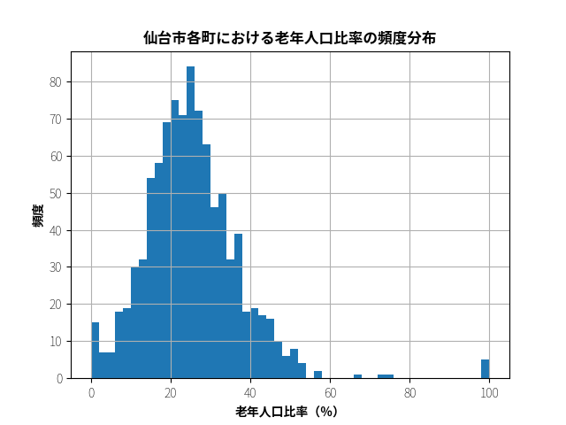

# 仙台高齢化地域の可視化

- Python, JavaScript, C言語を使って公共データを処理し、仙台の高齢化地域をブラウザ上で閲覧できるようにする。
- 私が住んでいる仙台のGIS（地理情報システム）データに興味があったのが動機。
- コロナウイルスでデータ可視化に注目が集まる今日この頃に、Python や JavaScript のデータ処理ツールに慣れたかった。
  
## ToC

- [仙台高齢化地域の可視化](#%e4%bb%99%e5%8f%b0%e9%ab%98%e9%bd%a2%e5%8c%96%e5%9c%b0%e5%9f%9f%e3%81%ae%e5%8f%af%e8%a6%96%e5%8c%96)
  - [ToC](#toc)
  - [Usage](#usage)
    - [仙台高齢化ヒートマップの可視化手順](#%e4%bb%99%e5%8f%b0%e9%ab%98%e9%bd%a2%e5%8c%96%e3%83%92%e3%83%bc%e3%83%88%e3%83%9e%e3%83%83%e3%83%97%e3%81%ae%e5%8f%af%e8%a6%96%e5%8c%96%e6%89%8b%e9%a0%86)
    - [必要ファイルの生成手順](#%e5%bf%85%e8%a6%81%e3%83%95%e3%82%a1%e3%82%a4%e3%83%ab%e3%81%ae%e7%94%9f%e6%88%90%e6%89%8b%e9%a0%86)
    - [Matplotlib による仙台の各町境界の描画手順](#matplotlib-%e3%81%ab%e3%82%88%e3%82%8b%e4%bb%99%e5%8f%b0%e3%81%ae%e5%90%84%e7%94%ba%e5%a2%83%e7%95%8c%e3%81%ae%e6%8f%8f%e7%94%bb%e6%89%8b%e9%a0%86)
    - [仙台市内の特定の小字の緯度経度情報の表示手順](#%e4%bb%99%e5%8f%b0%e5%b8%82%e5%86%85%e3%81%ae%e7%89%b9%e5%ae%9a%e3%81%ae%e5%b0%8f%e5%ad%97%e3%81%ae%e7%b7%af%e5%ba%a6%e7%b5%8c%e5%ba%a6%e6%83%85%e5%a0%b1%e3%81%ae%e8%a1%a8%e7%a4%ba%e6%89%8b%e9%a0%86)
  - [Packages](#packages)
  - [Files](#files)
    - [`vis-map.js`と`index.html` (実際のページを開く)](#vis-mapjs%e3%81%a8indexhtml-%e5%ae%9f%e9%9a%9b%e3%81%ae%e3%83%9a%e3%83%bc%e3%82%b8%e3%82%92%e9%96%8b%e3%81%8f)
    - [`colormap.html` (実際のページを開く)](#colormaphtml-%e5%ae%9f%e9%9a%9b%e3%81%ae%e3%83%9a%e3%83%bc%e3%82%b8%e3%82%92%e9%96%8b%e3%81%8f)
    - [`age_structure.py`](#agestructurepy)
    - [`position.py`](#positionpy)
    - [`analyze.py`](#analyzepy)
    - [`town_shapes.py`](#townshapespy)
    - [`constants.py`](#constantspy)
    - [`parse.c`](#parsec)
    - [`results/`](#results)
    - [`raw/`](#raw)
  - [Discussion](#discussion)
    - [交通結節点と新興住宅地では高齢化率が低い](#%e4%ba%a4%e9%80%9a%e7%b5%90%e7%af%80%e7%82%b9%e3%81%a8%e6%96%b0%e8%88%88%e4%bd%8f%e5%ae%85%e5%9c%b0%e3%81%a7%e3%81%af%e9%ab%98%e9%bd%a2%e5%8c%96%e7%8e%87%e3%81%8c%e4%bd%8e%e3%81%84)
    - [昭和中期に開発された住宅地や僻地では高齢化が進む](#%e6%98%ad%e5%92%8c%e4%b8%ad%e6%9c%9f%e3%81%ab%e9%96%8b%e7%99%ba%e3%81%95%e3%82%8c%e3%81%9f%e4%bd%8f%e5%ae%85%e5%9c%b0%e3%82%84%e5%83%bb%e5%9c%b0%e3%81%a7%e3%81%af%e9%ab%98%e9%bd%a2%e5%8c%96%e3%81%8c%e9%80%b2%e3%82%80)
    - [特殊な施設がある町では独特な人口傾向が見られる](#%e7%89%b9%e6%ae%8a%e3%81%aa%e6%96%bd%e8%a8%ad%e3%81%8c%e3%81%82%e3%82%8b%e7%94%ba%e3%81%a7%e3%81%af%e7%8b%ac%e7%89%b9%e3%81%aa%e4%ba%ba%e5%8f%a3%e5%82%be%e5%90%91%e3%81%8c%e8%a6%8b%e3%82%89%e3%82%8c%e3%82%8b)
    - [仙台の町の半分以上は「超高齢社会」である](#%e4%bb%99%e5%8f%b0%e3%81%ae%e7%94%ba%e3%81%ae%e5%8d%8a%e5%88%86%e4%bb%a5%e4%b8%8a%e3%81%af%e8%b6%85%e9%ab%98%e9%bd%a2%e7%a4%be%e4%bc%9a%e3%81%a7%e3%81%82%e3%82%8b)
  - [Todos](#todos)
  - [Reference](#reference)
    - [仙台市の町別の年齢別人口データ（令和２年４月１日）](#%e4%bb%99%e5%8f%b0%e5%b8%82%e3%81%ae%e7%94%ba%e5%88%a5%e3%81%ae%e5%b9%b4%e9%bd%a2%e5%88%a5%e4%ba%ba%e5%8f%a3%e3%83%87%e3%83%bc%e3%82%bf%e4%bb%a4%e5%92%8c%ef%bc%92%e5%b9%b4%ef%bc%94%e6%9c%88%ef%bc%91%e6%97%a5)
    - [宮城県各市町村の町の GPS 座標情報（平成 30 年分）](#%e5%ae%ae%e5%9f%8e%e7%9c%8c%e5%90%84%e5%b8%82%e7%94%ba%e6%9d%91%e3%81%ae%e7%94%ba%e3%81%ae-gps-%e5%ba%a7%e6%a8%99%e6%83%85%e5%a0%b1%e5%b9%b3%e6%88%90-30-%e5%b9%b4%e5%88%86)
    - [町別の形状データ（平成２７年分・世界測地系緯度経度・Shapefile：04 宮城県）](#%e7%94%ba%e5%88%a5%e3%81%ae%e5%bd%a2%e7%8a%b6%e3%83%87%e3%83%bc%e3%82%bf%e5%b9%b3%e6%88%90%ef%bc%92%ef%bc%97%e5%b9%b4%e5%88%86%e3%83%bb%e4%b8%96%e7%95%8c%e6%b8%ac%e5%9c%b0%e7%b3%bb%e7%b7%af%e5%ba%a6%e7%b5%8c%e5%ba%a6%e3%83%bbshapefile04-%e5%ae%ae%e5%9f%8e%e7%9c%8c)
    - [地図データ：](#%e5%9c%b0%e5%9b%b3%e3%83%87%e3%83%bc%e3%82%bf)

## Usage

### 仙台高齢化ヒートマップの可視化手順

1. [Open on GitHub](https://azureleaf.github.io/ageing-sendai) / Or open `index.html` locally with the browser

- Screenshot:
   

### 必要ファイルの生成手順

1. Download public data files from the internet (See reference)
2. Specify the paths of downloaded files in `constants.py`
3. Install Python 3 and `pipenv`
4. Install `Noto Sans CJK JP` font
   - Or, specify any of your available Japanese fonts at `constants.py`)
5. `pipenv shell`
6. `pipenv install`
7. `mkdir csv`
8. `python3 analyze.py`
   - Generates a CSV
   - Configure bool flags to generate optional CSV / JSON / histogram fig

### Matplotlib による仙台の各町境界の描画手順

1. `python3 town_shape.py`

- 形状頂点データを元にすべての町を描画した結果は以下の通り
- 色分けは境界を明示する以外の意味はありません
- よく見ると、「穴が空いた形状の町」では余計な線が描画されてしまっている。Matplotlibで`Polygon`ではなく`Path`を使うと解決するかも？
   

### 仙台市内の特定の小字の緯度経度情報の表示手順

1. Specify the name of the ward, oaza(大字), and koaza(小字) in the `parse.c`
2. Compile: `clang -o parse parse.c` with Clang, for example
3. Run: `./parse` on Linux, for example

## Packages

- `pandas`
- `numpy`
- `matplotlib`
- `xlrd`: Excel ファイルの読み込み
- `myshp`: Shapefile の読み込み
- `leaflet.js`: 地図上へのプロット

## Files

### `vis-map.js`と`index.html` ([実際のページを開く](https://azureleaf.github.io/ageing-sendai/))

- OpenStreetMap への高齢化情報のプロット
- `vis-map.js`内部で以下の Python で出力されたデータを使っている
- 老年人口比率（0%-100%）を HSL の色相（0 度-240 度）に置換して表示色を決定する
- leaflet.js の Popup オブジェクトを使って詳細情報を表示する

### `colormap.html` ([実際のページを開く](https://azureleaf.github.io/ageing-sendai/colormap.html))

- 地図へプロットする際のカラーマッピングの検討に使ったファイル
- カラーマップとして有名な「Hot」「Reds」「Autumn」「Jet」「HSV」を検討した
- 結局、見やすさを考えて今回は「HSV」の一部を切り取った以下の配色パターンを使うことにした
- 差をはっきりさせるため、老年人口比率に上限のカットオフ値を設定した
- カットオフにより色と老年人口比率の線形性が失われるので科学的にはあまり望ましくないが...今回は見やすさを優先した
- データの見せ方は結構難しい。今後さらに要検討

### `age_structure.py`

- 仙台市の年齢別・町名別・性別人口データのエクセルファイルを処理する
- 元データのエクセルファイルは区と性別ごとに複数のスプレッドシートにわかれてしまっているので集約する
- 「大字」と「小字」で人口がダブルカウントされているため、大字に集約する
- 例えば「種次字中屋敷」「種次字番古」「種次字南番古」「種次（大字計）」という行が連続しているので「種次」という大字名を記憶し、それを手がかりにして「種次字」で始まる地名の行を削除する
- 列の見出しが日本語表記のままではデータ処理で扱いにくいので、英字の略号に変換
- ここまでの結果（５歳刻みでの町別・年齢別人口構成データ）を CSV に出力する

### `position.py`

- `age_structure.py`の出力結果である年齢別人口構成データを DataFrame A として取り込む
- 仙台市の各町・丁・大字の代表点の GPS 座標データが入ったエクセルファイルを処理する。 データを整形して DataFrame B とする
- 「丁目」の書式が年齢構成ファイルでは数字だが、位置情報ファイルでは漢数字になってしまっているので統一する
- DataFrame A と DataFrame B を、町名と区名をキーにして JOIN する（町名だけをキーにすると失敗する。例えば青葉区と太白区両方に「茂庭」という町名があるため）
- ここまでの集計結果（町別の人口三区分の人口構成と町の位置情報）を CSV として出力する

### `analyze.py`

- `position.py`を内部で呼び出す
- これを元に人口三区分（年少人口、生産年齢人口、老年人口）毎の人数・人口比を集計し、また高齢化率、従属人口比率、老年化指数、男女比も算出する
- この集計結果を CSV または JSON に保存し、またヒストグラムにする

### `town_shapes.py`

- ダウンロードしてきた Shapefile は、仙台の全ての町それぞれについて、その境界の頂点座標情報を持っている
- しかし Shapefile のままだと扱いにくいので Pandas の DataFrame に変換し、頂点情報を使ってグラフに描画していく
- 仙台市の町ごとの形状データを処理し、町別年齢構成データと合わせて色分けし可視化...したかったが、この形状データと他の年齢構成データの地域区分の大きさに齟齬があるためこのプランは挫折した

### `constants.py`

- 複数の Python モジュールで共用するデータ

### `parse.c`

- 仙台市の小字の位置情報ファイルを処理する。元データが 16 万行もあるため、処理速度のためこのファイルのみ C 言語を選んだ
- Shift-JIS から UTF-8 に変換し、宮城県全体から仙台市内の部分を抽出し、また特定の小字の行を抽出する機能を実装済み
- 当初`strtok()`の挙動をよく理解していなかったので、作成時にちょっと詰まった
- しかし、小字位置情報と年齢人口データの間でもデータの欠損などがあることがわかり、可視化プロジェクトには使えないことにあとで気づいた...

### `results/`

- Python で出力される CSV ファイルの置き場（`.gitignore`済）

### `raw/`

- ダウンロードしてきた元ファイルの置き場
- データサイズが大きいため元ファイルは`.gitignore` している

## Discussion

高齢化率のヒートマップを眺めると以下のようなことがわかる

### 交通結節点と新興住宅地では高齢化率が低い

- 泉区泉中央
- 泉区将監殿
- 泉区紫山
- 太白区あすと長町
- 太白区富沢
- 青葉区錦が丘：　年少人口が４０％程度で、仙台で一番こどもの割合が多い
- 若林区荒井
- 宮城野区仙台駅周辺
- 宮城野区新田東

### 昭和中期に開発された住宅地や僻地では高齢化が進む

- 泉区加茂
- 泉区長命ケ丘
- 泉区高森
- 泉区松陵
- 泉区鶴ケ丘
- 太白区人来田
- 太白区茂庭台
- 太白区袋原
- 若林区沿岸部

### 特殊な施設がある町では独特な人口傾向が見られる

- 霞目と苦竹：　自衛隊駐屯地の所在地。大半が自衛隊員であるため、高齢化率が低く男女比は男性がかなり多い
- 古城二丁目：　仙台刑務所の所在地。主に男子刑務所であるため男女比も男性がかなり多い
- 三神峯：　大学職員宿舎しかないため、高齢化率が低い
- 川内亀岡町・川内元支倉：　国家公務員宿舎の所在地。国家公務員は男性が多いため、男女比も男が多く高齢化率も低い
- 大沢三丁目：　老人ホーム以外の住居がないためか、高齢化率が驚異の 98％

### 仙台の町の半分以上は「超高齢社会」である

- 「超高齢社会」「高齢社会」「高齢化社会」の定義を町に当てはめると以下のような分類ができる
- 町ごとに人口や面積がまったく違うのでそこまで意味がない数字だが...
- なお、仙台市の高齢化率は 23.7％である

|   地域種別   |  老年人口比率   | 町の数 |
| :----------: | :-------------: | -----: |
| 非高齢化地域 |     7%未満      |     37 |
|  高齢化地域  | 7%以上 14%未満  |     91 |
|   高齢地域   | 14%以上 21%未満 |    214 |
|  超高齢地域  |     21%以上     |    607 |
|     合計     |        -        |    949 |

 

## Todos

- 統計検定で信頼性を検証する。人数が少なすぎて高齢化率の計算が統計的に意味のない地域もある。統計検定で除外すべきだが、どの検定をやるべきか？？？要検討
- もっといい元データを見つける。データ作成機関ごとに町の区分方法や識別番号などがバラバラで泣きたくなる
- 店舗データなどがあればもっとおもしろい分析ができそうだが...「買い物難民指数」を発明するとか、年齢別死亡率と併せて今後の高齢化動向を予測するとか

## Reference

### 仙台市の町別の年齢別人口データ（令和２年４月１日）

- 町名別年齢（各歳）別住民基本台帳人口　http://www.city.sendai.jp/chosatoke/shise/toke/jinko/chomebetsu.html
- 仙台の町ごとの１歳刻み・男女別での年齢人口のデータを含む
- 元データの宮城野区の地名「二（大字計）」は「二木（大字計）」の間違いだったので、これが登場する３箇所を手動で置換した

### 宮城県各市町村の町の GPS 座標情報（平成 30 年分）

- 位置参照情報ダウンロードサービス（国土交通省）： http://nlftp.mlit.go.jp/cgi-bin/isj/dls/_choose_method.cgi
- このデータは仙台の各町の代表点の緯度経度を含んでいる

### 町別の形状データ（平成２７年分・世界測地系緯度経度・Shapefile：04 宮城県）

- 独立行政法人統計センター　地図で見る統計(統計 GIS)　https://www.e-stat.go.jp/gis/statmap-search?page=1&type=2&aggregateUnitForBoundary=A&toukeiCode=00200521&toukeiYear=2015&serveyId=A002005212015

### 地図データ：

- OpenStreetMap：　https://www.openstreetmap.org/
- `matplotlib` + `basemap`：　描画結果がどうも洗練されていないし解像度がしょぼそうなのでボツ
- `matplotlib` + `pyshp`：　国交省の Shapefile における地域区分の単位が人口データの区分単位とズレているためボツ
- Google Map：　 OpenStreetMap と同じことができるが、ライセンス的に面倒そうなのでボツ
